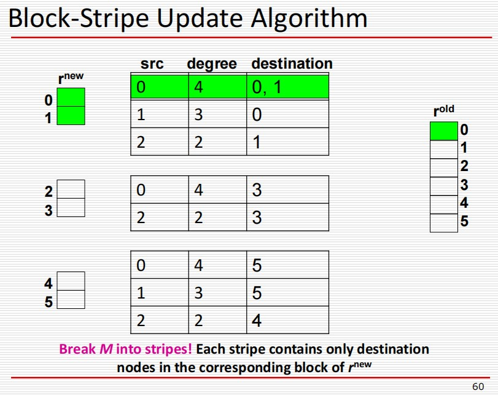
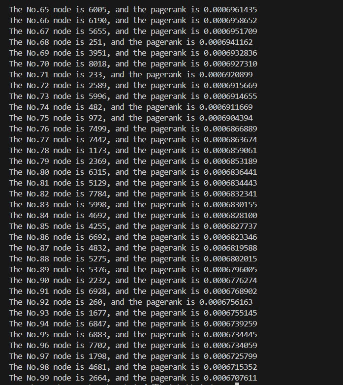
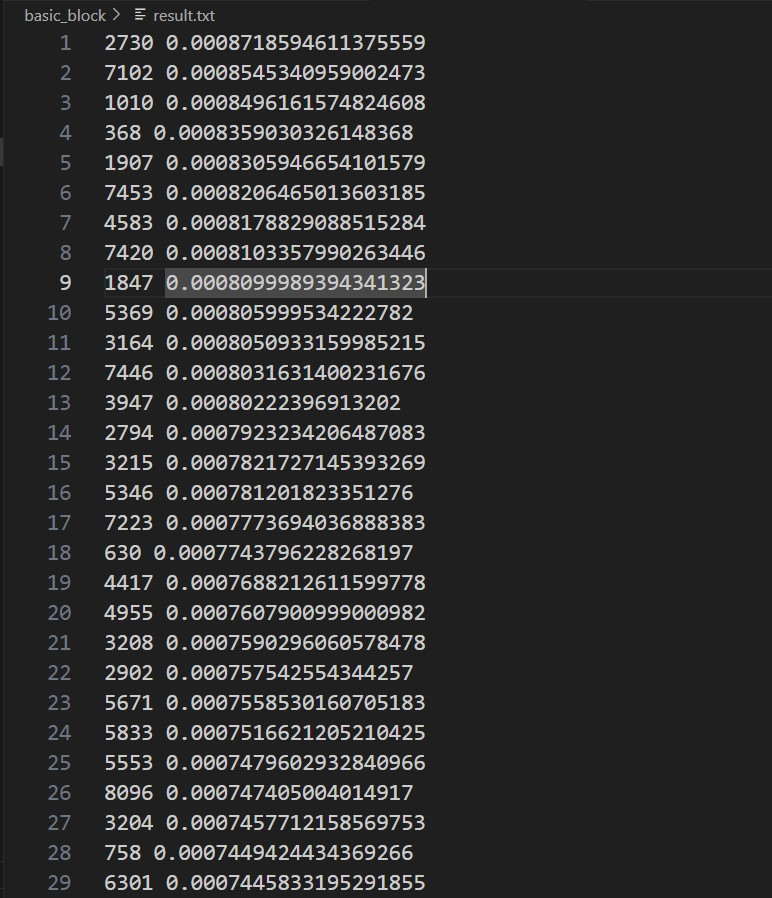
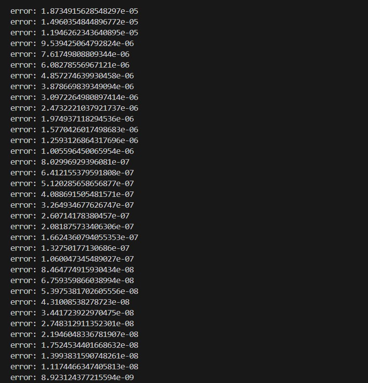
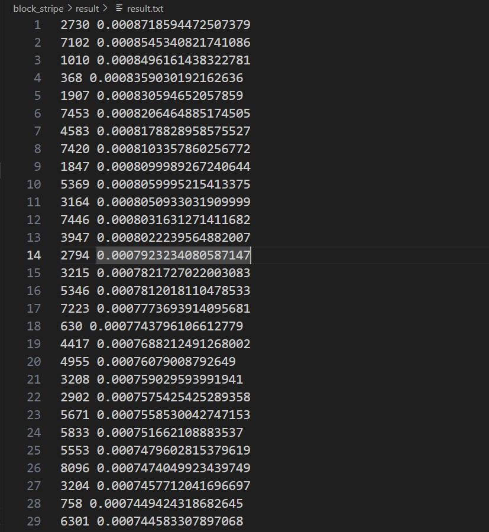
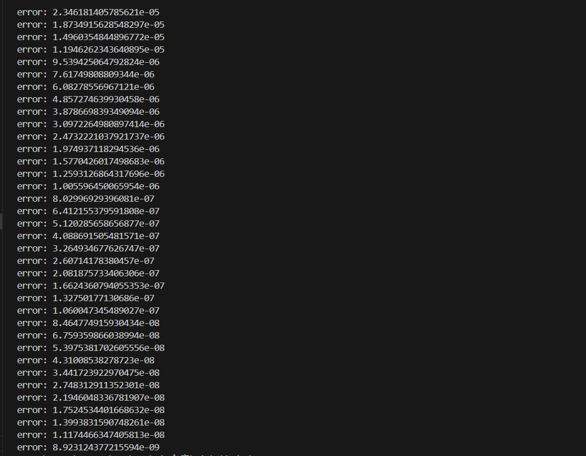
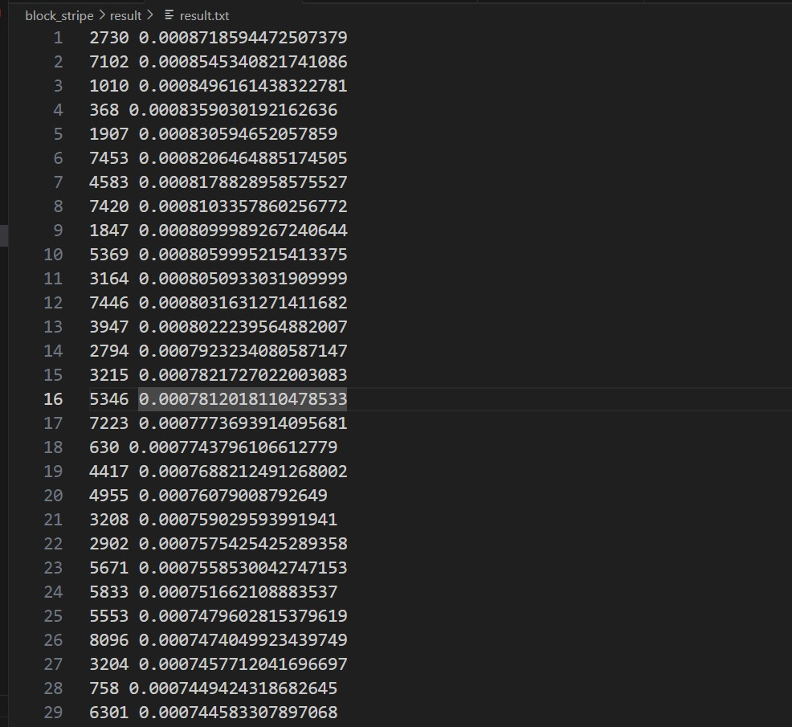

# Pagerank report

## 实验概要

> 本次实验研究Pagerank算法在web网页中权值排序中的应用，并且分别实现了Pagerank基本算法和block stripe分块算法。我们首先实现了Pagerank基本算法，然后结合实际场景中内存不足的情况，我们实现了block stripe分块的Pagerank算法。我们将两种算法的最终结果进行了比较，结合其运行速度等情况我们也思考了Pagerank算法的未来改进方向。


## 实验相关统计信息

### 数据集

#### 数据格式

本次实验的数据集为`data.txt`，其数据格式为每行按照<**FromNodeID ToNodeID**>的方式进行存储，其表示**graph**中存在从节点**FromNodeID**到**ToNodeID**的一条边。


#### 节点个数及最大最小索引

经过我们的统计，本数据集中节点的最大索引为8297，最小索引为1，出现的节点总个数为8297。


#### spider trap以及dead end

本数据集中存在只有入度但没有出度的节点，即**dead end**；同时还存在没有出度的节点集，即**spider trap**。这两种情况不加处理都会造成不利影响。如果跳转到**dead end**不加处理，则之后无法再进行跳转；如果跳转到**spider trap**不加处理，则之后只能继续在该节点集内部进行跳转而不能跳转到其以外的节点。本次实验中，我们为了解决这两种情况，引入了一下方法：

1. 引入**belta**来模拟随机跳转因子，从而解决**spider trap**问题；
2. 对r进行归一化操作来解决**dead end**问题。


## 实验原理

**Pagerank**算法的总步骤其实可以分为以下几个步骤：

1. 初始化所有web网页的**Pagerank**值为**1/N**，其中**N**为总网页数；
2. 根据网页之间的关系得出每个网页的出度，以及其指向的节点；
3. 设置收敛条件，迭代计算每个网页的**Pagerank**值，每次都进行归一化处理；
4. 计算所有网页的新旧**Pagerank**值的差值的绝对值的和，然后将其与收敛条件进行比较，如果满足收敛条件就结束迭代过程。


本次实验中我们对Pagerank算法进行了基本算法和block stripe算法进行了实现，同时还有对block stripe算法的加速实现。下面我们将分别对其进行介绍：

### basic Pagerank

#### 算法介绍


我们实现的基本算法如上所示，此算法完美解决了**spider traps**问题和**dead ends**问题。基本逻辑是最开始对r进行初始化，然后迭代计算，首先计算belta*M之后的r的值，然后对此r进行归一化处理。具体是利用到S如上进行归一化，使所有节点的Pagerank值的和为1。每次计算完后，我们会计算是否满足收敛条件，并且对r进行更新。


### block stripe pagerank

#### 算法介绍



我们的分块算法的数据组织形式如上所示，我们依据对r的分组，也相应地对M进行分组。把与每组r更新相关的M组织成如上形式进行一一对应。当我们对某一组的r进行更新时，我们便可以定位与此相关的分组M，然后进行更新即可。

我们对**spider traps**问题和**dead ends**问题的解决方法与基本算法完全一致，block stripe算法就是基本算法在内存不足的情况下的一种变形计算方式。


### block stripe pagerank加速算法

#### 算法介绍

如果我们每次可以将M的一个分组读入内存，那么我们便可以使用这个算法来大大加快速度。我们对某一组r_new进行计算时，我们来循环确定M中的src是否属于某一相同的组，我们将其组成一个列表，然后导入某一块的r值进入内存。这样的话，对于某一组r_new的更新我们可以做的不重复的读取某一组的r。于是达到了加速的目的。其中我们主要的修改如下：

1. M分块读取，不再按行读取；
2. 分开r_new计算时，如果src属于某一相同的块，直接导入此块的r值，然后一并更新。


## 关键部分代码解析

我们按照上述解释的那样，分basic Pagerank，block stripe pagerank以及block stripe pagerank加速算法来解释。

### basic Pagerank

#### 代码实现

我们Pagerank基本算法的实现是建立在内存充足的基础上的，即我们可以把所有节点的Pagerank值和他们的M矩阵都读入到内存。每次计算的时候其实便可以进行矩阵运算来达到加速运算的目的。


##### 导入数据集

在读取**data.txt**的数据时，我们获取到其中的节点关系以及节点总数目。并且我们根据这些建立**link_matrix**矩阵。其每一个元素是一个列表，里面存储着对应节点的索引、出度还有到达的所有节点。其中到达的所有节点组成一个列表。具体代码如下：

```python
def load_data():
    # Load the data from the file
    global max_node_index
    global Num
    global nodes_set
    link_matrix = [[i,0,[]] for i in range(max_node_index+1)]  #link matrix   src degree dest[]
    max_node_index=0
    with open(data_path) as f:
        lines = f.readlines()
        for line in lines:
            split_line = line.split()
            fr, to = int(split_line[0]), int(split_line[1])
            link_matrix[fr][1]+=1   #degree
            link_matrix[fr][2].append(to)  #dest
            max_node_index = max(max_node_index,fr,to)
    Num=max_node_index
    #把link_matrix中出度为0的节点删除
    link_matrix=[link_matrix[i] for i in range(max_node_index+1) if link_matrix[i][1]>0]
    with open(LINK_MATRIX_PATH, "wb") as f:
        for row in link_matrix:
            pkl.dump(row, f)
```


##### Pagerank值初始化

开始进行迭代前，我们首先将所有节点的**Pagerank**值都初始化为**1/Num**。

```python
def basic_pagerank():
    #initialize the r_old
    r_old = np.ones(Num+1)*1.0 / Num
    r_old[0] = 0.0
    ...
```


##### r_new计算

我们**r_new**的计算遵照上述算法的内容，首先依据每个节点的出度对其**dest**的节点的**Pagerank**值进行计算。然后再以此进行归一化操作得到新一轮的**r**的值。

首先依据每个节点的出度对其**dest**的节点的**Pagerank**值进行计算：

```python
def compute_rnew(r_old):
    r_new = np.zeros(Num+1)*1.0
    with open(LINK_MATRIX_PATH, 'rb') as f:
        while True:
            try:
                # 逐行读取
                row_data = pkl.load(f)
                # print(row_data)
                src, degree, dest = row_data
                for i in range(degree):
                    r_new[dest[i]] += belta * r_old[src] / degree
            except EOFError:
                break  # 如果到达文件末尾，跳出循环
    ...
    #re-insert the leaked
    sum=np.sum(r_new)
    sum-=r_new[0]  
    leaked=np.ones(Num+1)*(1-sum)/Num
    r_new+=leaked
    r_new[0] = 0.0
    return r_new
```


归一化操作：

```python
	#re-insert the leaked
    sum=np.sum(r_new)
    sum-=r_new[0]  
    leaked=np.ones(Num+1)*(1-sum)/Num
    r_new+=leaked
    r_new[0] = 0.0
    ...
```

综上，我们便完成了新一轮r的更新。


##### 收敛条件判断

如下便是我们对收敛条件的判断：

```python
while np.sum(np.abs(r_new - r_old)) > epsilon:
	print(np.sum(np.abs(r_new - r_old)))
    r_old = r_new
    r_new = compute_rnew(r_old)
```


##### 最终结果写入文件

本实验中我们对top100的节点的索引以及其Pagerank值写入文件，具体实现函数如下：

```python
def print_result(r_new):
    #降序排列
    index = np.argsort(-r_new)
    #output the result
    for i in range(100):
        print("The No.%d node is %d, and the pagerank is %.10f" % (i, index[i], r_new[index[i]]))
    with open(RESULT_PATH, "w") as f:
        for i in range(100):
            f.write(f"{index[i]} {r_new[index[i]]}\n")
```

如上，我们首先对r_new中的Pagerank值取相反数，然后调用np.argsort函数便可以实现降序排序，然后我们根据获取的index数组来将top100的节点的索引以及Pagerank值写入文件即可。


### block stripe pagerank

#### 代码实现

##### 导入数据集

在读取**data.txt**的数据时，我们获取到其中的节点关系以及节点总数目。并且我们根据这些建立**link_matrix**矩阵。其每一个元素是一个列表，里面存储着对应节点的索引、出度还有到达的所有节点。其中到达的所有节点组成一个列表。然后我们对**link_matrix**依据对r的分组进行对应分组，然后将我们的分组写入对应的磁盘进行保存。


构建**link_matirx**:

```python
def load_data():
    # Load the data from the file
    global max_node_index
    global Num
    global nodes_set
    link_matrix = [[i,0,[]] for i in range(max_node_index+1)]  #link matrix   src degree dest[]
    max_node_index=0
    with open(data_path) as f:
        lines = f.readlines()
        for line in lines:
            split_line = line.split()
            fr, to = int(split_line[0]), int(split_line[1])
            link_matrix[fr][1]+=1   #degree
            link_matrix[fr][2].append(to)  #dest
            max_node_index = max(max_node_index,fr,to)
    Num=max_node_index
    #把link_matrix中出度为0的节点删除
    link_matrix=[link_matrix[i] for i in range(max_node_index+1) if link_matrix[i][1]>0]
    
    ...
    
    #保存到文件
    for i in range(group_num):
        with open(LINK_MATRIX_PATH_PREFIX+str(i)+LINK_MATRIX_PATH_SUFFIX,'wb') as f:
            for line in link_matrix_groups[i]:
                pkl.dump(line,f)
```


对**link_matrix**进行分组：

```python
...
link_matrix_groups=[[[i,0,[]] for i in range(max_node_index+1)] for j in range(group_num)]
    #分块
    for line in link_matrix:
        for dest in line[2]:
            group_id=get_group_id(dest)
            link_matrix_groups[group_id][line[0]][1]=line[1]  #注意这里的degree是一样的
            link_matrix_groups[group_id][line[0]][2].append(dest)
    #把每个group中的出度为0的节点删除
    for i in range(group_num):
        link_matrix_groups[i]=[link_matrix_groups[i][j] for j in range(max_node_index+1) if link_matrix_groups[i][j][1]>0]
...
```


分组写入磁盘：

```python
	#保存到文件
    for i in range(group_num):
        with open(LINK_MATRIX_PATH_PREFIX+str(i)+LINK_MATRIX_PATH_SUFFIX,'wb') as f:
            for line in link_matrix_groups[i]:
                pkl.dump(line,f)
```


##### 分块r_new计算

我们对r_new进行分块更新计算，每次我们依据r_new当前的块号来寻找到存储M的文件，从里面逐行读取，依据读取的信息再读磁盘寻找对应的src节点的Pagerank值。

我们会用一个列表来对每块的r_new的和值进行存储，这样我们对所有块的r_new进行初步更新后便获得了s的值。然后便可以分块进行归一化操作。

具体的代码如下：

```python
def compute_rnew(flag):
    sum_r_group=np.zeros(group_num)
    for i in range(group_num):
        #initialize r_new_stripe
        r_new_stripe =np.zeros(get_group_size())
        with open(LINK_MATRIX_PATH_PREFIX+str(i)+LINK_MATRIX_PATH_SUFFIX,'rb') as fl:
            while True:
                try:
                    # 逐行读取
                    row_data = pkl.load(fl)
                    # print(row_data)
                    src, degree, dest = row_data
                    #读出r_old[src]
                    r_index=get_group_id(src)
                    if flag==0:
                        with open(R_VECTOR_PATH_PREFIX+str(r_index)+R_VECTOR_PATH_SUFFIX,'rb') as f_r:
                            r_tmp_stripe=pkl.load(f_r)
                    else:
                        with open(R_NEW_VECTOR_PATH_PREFIX+str(r_index)+R_NEW_VECTOR_PATH_SUFFIX,'rb') as f_r:
                            r_tmp_stripe=pkl.load(f_r)
                    for k in range(len(dest)):
                        dest_index=dest[k]%get_group_size()
                        r_new_stripe[dest_index] += belta * r_tmp_stripe[src%get_group_size()] / degree
                except EOFError:
                    break  # 如果到达文件末尾，跳出循环
        sum_r_group[i]=np.sum(r_new_stripe)
        #保存r_new至磁盘上
        if flag==0:
            with open(R_NEW_VECTOR_PATH_PREFIX+str(i)+R_NEW_VECTOR_PATH_SUFFIX,'wb') as fr:
                pkl.dump(r_new_stripe,fr)
        else:
            with open(R_VECTOR_PATH_PREFIX+str(i)+R_VECTOR_PATH_SUFFIX,'wb') as fr:
                pkl.dump(r_new_stripe,fr)
    return np.sum(sum_r_group)
```


##### 分块r_new进行归一化

当我们获取到**s**值后，然后我们对**r_new**进行分块归一化操作，并在里面计算**error**，来为后面的收敛条件判断做准备。

具体代码如下：

```python
def normalize_r_new(flag,sum):
    error=0.0
    for i in range(group_num):
        if flag==0:
            with open(R_NEW_VECTOR_PATH_PREFIX+str(i)+R_NEW_VECTOR_PATH_SUFFIX,'rb') as f:
                r_new_stripe=pkl.load(f)
            with open(R_VECTOR_PATH_PREFIX+str(i)+R_VECTOR_PATH_SUFFIX,'rb') as f1:
                r_old_stripe=pkl.load(f1)
        else:
            with open(R_VECTOR_PATH_PREFIX+str(i)+R_VECTOR_PATH_SUFFIX,'rb') as f:
                r_new_stripe=pkl.load(f)
            with open(R_NEW_VECTOR_PATH_PREFIX+str(i)+R_NEW_VECTOR_PATH_SUFFIX,'rb') as f1:
                r_old_stripe=pkl.load(f1)
        r_new_stripe+=np.ones(get_group_size())*(1-sum)/Num
        if i==0:
            r_new_stripe[0] = 0.0
        if i==group_num-1:
            r_new_stripe[get_last_group_size():] = [0]*(get_group_size()-get_last_group_size())
        error+=np.sum(np.abs(r_new_stripe-r_old_stripe))
        if flag==0:
            with open(R_NEW_VECTOR_PATH_PREFIX+str(i)+R_NEW_VECTOR_PATH_SUFFIX,'wb') as f2:
                pkl.dump(r_new_stripe,f2)
        else:
            with open(R_VECTOR_PATH_PREFIX+str(i)+R_VECTOR_PATH_SUFFIX,'wb') as f2:
                pkl.dump(r_new_stripe,f2)
    return error
```


##### 收敛条件判断

收敛条件的判断与basic Pagerank算法一致，不再赘述。


##### 最终结果写入文件

最终结果写入文件与**basic Pagerank**基本一致，只不过此时是分块进行。将一个块更新之后，我们从里面挑选出排名前100的节点的索引和Pagerank值，将其加入到result列表中。待所有块都更新完之后，以及最后达到收敛情况后，我们在对result列表进行排序，从中间挑选前100的写入磁盘即可。

```python
def print_result():
    #降序排列
    results=[]
    #先从磁盘读取r_stripe
    for i in range(group_num):
        r_stripe=pkl.load(open(R_VECTOR_PATH_PREFIX+str(i)+R_VECTOR_PATH_SUFFIX,'rb'))
        #保存top100至results
        index = np.argsort(-r_stripe)
        for j in range(OUTPUT_NUM):
            results.append((index[j]+i*get_group_size(),r_stripe[index[j]]))
    #top100排序
    results.sort(key=lambda x:x[1],reverse=True)
    #output the result
    with open(RESULT_PATH, "w") as f:
        for i in range(OUTPUT_NUM):
            f.write(f"{results[i][0]} {results[i][1]}\n")
```


### block stripe pagerank加速算法

#### 代码实现

##### 导入数据集

加速算法中导入数据集与**block stripe pagerank**算法中不一样的便是，此时我们的M是可以分块读取的，而不是按行读取。所以我们把M分块写入时我们是直接将一整块的内容导入磁盘，而不是一行行写入磁盘。

**block stripe pagerank**算法如下：

```python
#保存到文件
    for i in range(group_num):
        with open(LINK_MATRIX_PATH_PREFIX+str(i)+LINK_MATRIX_PATH_SUFFIX,'wb') as f:
            for line in link_matrix_groups[i]:
                pkl.dump(line,f)
```


**block stripe pagerank**加速算法如下：

```python
#保存到文件
    for i in range(group_num):
        with open(LINK_MATRIX_PATH_PREFIX+str(i)+LINK_MATRIX_PATH_SUFFIX,'wb') as f:
            pkl.dump(link_matrix_groups[i],f)
```


##### 分块r_new计算

依据我们上述的思想，我们加速算法计算r_new如下：

```python
def compute_rnew(flag):
    sum_r_group=np.zeros(group_num)
    for i in range(group_num):
        #initialize r_new_stripe
        r_new_stripe =np.zeros(get_group_size())*1.0
        fl = open(LINK_MATRIX_PATH_PREFIX+str(i)+LINK_MATRIX_PATH_SUFFIX,'rb')
        # 获取矩阵
        matrix_stripe = pkl.load(fl)
        # r_old_stripe
        for j in range(group_num):
            # src列表获取
            src_index_in_matrix = [idx for idx, elem in enumerate(matrix_stripe) if  get_group_size()*j<= elem[0] < get_group_size()*(j+1)] 
            if flag==0:
                with open(R_VECTOR_PATH_PREFIX+str(j)+R_VECTOR_PATH_SUFFIX,'rb') as f_r:
                    r_tmp_stripe=pkl.load(f_r)
            else:
                with open(R_NEW_VECTOR_PATH_PREFIX+str(j)+R_NEW_VECTOR_PATH_SUFFIX,'rb') as f_r:
                    r_tmp_stripe=pkl.load(f_r)
            for src_index in src_index_in_matrix:
                index = matrix_stripe[src_index][0]%get_group_size()
                degree = matrix_stripe[src_index][1]
                des_list = matrix_stripe[src_index][2]
                for k in range(len(des_list)):
                    dest_index=des_list[k]%get_group_size()
                    r_new_stripe[dest_index] += belta * r_tmp_stripe[index] / degree
        # sum计算
        sum_r_group[i]=np.sum(r_new_stripe)
        
        #保存r_new至磁盘上
        if flag==0:
            with open(R_NEW_VECTOR_PATH_PREFIX+str(i)+R_NEW_VECTOR_PATH_SUFFIX,'wb') as fr:
                pkl.dump(r_new_stripe,fr)
        else:
            with open(R_VECTOR_PATH_PREFIX+str(i)+R_VECTOR_PATH_SUFFIX,'wb') as fr:
                pkl.dump(r_new_stripe,fr)
    return np.sum(sum_r_group)
```

如上，可以看到我们避免了r的pagerank块的重复读取，每当我们读取一个r的块，就会解决掉每一块M中与其相关的r_new值的更新。这样大大提高了计算速度和效率。


## 结果分析

### basic pagerank

我们首先运行我们编写的**basic pagerank**算法，得到如下结果：




对应的结果文件中如下：




### block stripe Pagerank

我们运行我们编写的block stripe Pagerank算法，然后得到如下结果：




对应的结果文件如下：




### block stripe Pagerank加速算法

我们运行我们编写的block stripe Pagerank加速算法，得到的结果如下：




对应的结果文件如下：




### 总结

经过测试，我们的basic pagerank算法得出结果的速度最快，block stripe Pagerank加速算法次之，block stripe pagerank算法最慢。同时我们注意到三种算法对最后节点的排名是相同的，但是score值具有一些精度上的小差异。


## 改进方向

当内存不足的情况下，我们会使用分块的算法来用时间换空间。但是不合理的分块会导致时间的大量浪费，同时某些块的重复读取会导致大量的磁盘I/O，使得性能大大降低。因此未来的方向便是分块时如何制定合理的分块策略，如何减少块的重复读取和时间浪费。
